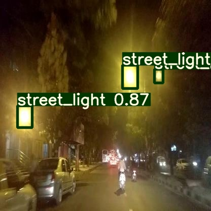
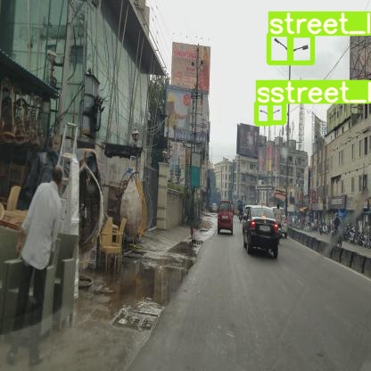

# Streetlights

To have better management of the city, the working of the street lights is of prime concern. So to have the detection I have trained a yolov5 model.

To train the model for daytime frames and nighttime frames you need to run the yolov5NightStreetLight.ipynb and collect the map score.

The daytime dataset is present in the [Link](https://iiitaphyd.sharepoint.com/:f:/r/sites/Mobility-Mobility-RA/Shared%20Documents/Mobility%20-RA/Amandeep%20Kumar/Amandeep/day_frames?csf=1&web=1&e=19V2RD). The dataset contains today of 1233 images, were I took the 70% of images for training, 10% for validation and 20% testing. The trained model is present in the [Link](https://drive.google.com/drive/folders/1XQ7Ll1aX2Jrww7DdNFFSdNPH_FPyqcAP).

The nighttime dataset is present in the [Link](https://iiitaphyd.sharepoint.com/:f:/r/sites/Mobility-Mobility-RA/Shared%20Documents/Mobility%20-RA/Amandeep%20Kumar/Amandeep/night_frames?csf=1&web=1&e=wHWDRg). The dataset contains today of 1175 images annotated street lights, were I took the 70% of images for training, 10% for validation and 20% testing. The trained model is present in the [Link](https://drive.google.com/drive/folders/1XQ7Ll1aX2Jrww7DdNFFSdNPH_FPyqcAP).

The dataset for the side view is present in the [Link](https://iiitaphyd.sharepoint.com/:f:/r/sites/Mobility-Mobility-RA/Shared%20Documents/Mobility%20-RA/Amandeep%20Kumar/Amandeep/side_view?csf=1&web=1&e=FArfgJ).

Open Source Dataset for Hyderabad, Warangal, and Vikarabad [Link](https://drive.google.com/file/d/1gaPOnrerAx68MLBlDdBtH9wEdzWdmAqS/view?usp=sharing).
